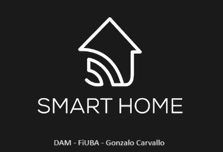

# Desarrollo de Aplicaciones Multiplataforma
Repositorio con el proyecto final de la materia DAM de la CEIoT de la FiUBA.

## Descripción del Proyecto

Este proyecto consta de una aplicación de un sistema domótico desarrollado con Angular e Ionic que permite controlar dispositivos electrónicos del hogar, ya sea el estado (encendido/apagado) como en intensidad (de 0% a 100%). Permite a los usuarios visualizar, controlar y programar (mediante un modal) dispositivos. También ver los detalles de los grupos.

## Características del Sistema
- **Visualización y Control**: Los usuarios pueden listar consumos o grupos de dispositivos. Pueden controlar tanto el estado de encendido como la intensidad de 0% a 100%. Tanto los consumos como los grupos tienen opciones para ver detalles.
- **Programación de Dispositivos**: Interfaz para programar los horarios de operación usando modales de Ionic.
- **Gestión de Usuarios**: Control y acceso seguro mediante una base de datos de usuarios (ver abajo detalle de usuarios y contraseña creadas para la prueba).

## Tecnologías Utilizadas
- **Frontend**: Angular 11, Ionic 5
- **Backend**: Node.js, Express
- **Base de Datos**: MySQL
- **Orquestación**: Docker

### Cumplimiento de Requisitos
- **Directivas Estructurales**: Implementadas con `ngIf` y `ngFor` en varios componentes del sistema para renderizado condicional y listas dinámicas.
- **Directiva de Atributo**: `CustomHighlightDirective` en `/src/app/directives` para cambiar estilos dinámicamente basados en el estado del dispositivo. En este caso se muestran de color verde los consumos que se encuentran encendidos.
- **Pipe Custom**: `MayusculasPipe` en `/src/app/pipes` para transformar textos a mayúsculas. Se usa para colocar el nombre de usuario en mayúscula en el mensaje de bienvenida.
- **Servicio para la API**: `ApiService` en `/src/app/services` para manejar todas las interacciones con el backend.
- **API en Express**: Backend en Node.js que maneja la lógica de negocio y la comunicación con la base de datos MySQL.

## Configuración y Ejecución con Docker
Se utiliza Docker para facilitar la configuración y ejecución del proyecto. En la raíz se encuentra el `docker-compose.yml` utilizado para levantar los servicios necesarios.

Inicia con 2 usuarios creados para login:

**Username:** pedro

**Password:** 1234

ó

**Username:** gonza

**Password:** 1234

## Contacto
**Docente:** Pedro Rosito - rositopedro@gmail.com

**Alumno:** Gonzalo Carvallo - gonzacarv@gmail.com

